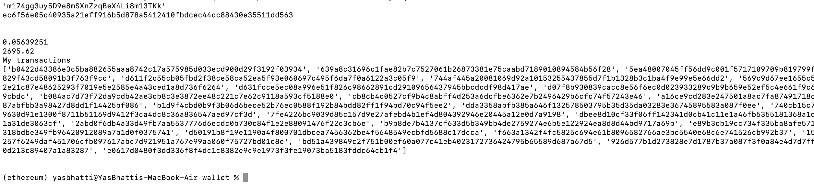

# Multi-Blockchain Wallet in Python

### Wallet objects (first image)

### Wallet objects (second image)

### "BTC-TEST" Transaction

### BlockCypher website BTC-TEST Transaction confirmation

### BlockCypher website BTC-TEST Transaction Details 

### ETHEREUM Check_Tran.py file output 

### MyCrypto app initial wallet balance (Before Transaction)

### MyCrypto app wallet balance (After Transaction)

### MyCrypto Transaction Status (TX status) image

